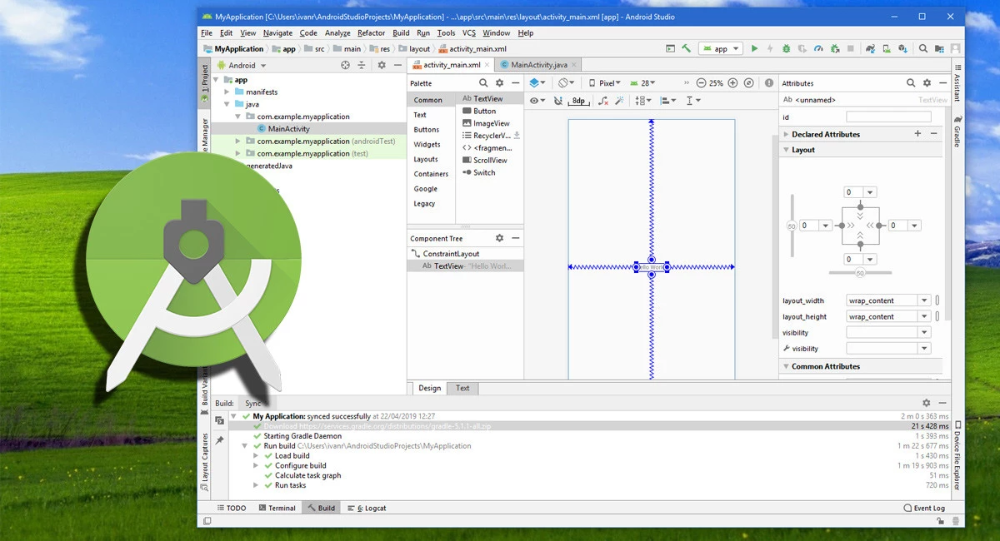

# 2025-1 Programación Móvil - Quiz

### Descripción del Aplicativo Móvil

Este aplicativo móvil es una plataforma interactiva dedicada a los aficionados del deporte, principalmente del fútbol, donde los usuarios podrán poner a prueba sus conocimientos sobre diversas disciplinas deportivas. El sistema se basa en una serie de preguntas de opción múltiple sobre temas como historia, jugadores, equipos, competiciones y estadísticas. Los usuarios podrán competir de manera individual <b>o en tiempo real con otros jugadores</b>, comparando sus resultados y obteniendo puntos por cada respuesta correcta.

Además, la aplicación contará con diferentes niveles de dificultad, desde preguntas más fáciles hasta desafíos complejos para expertos. Los usuarios podrán seguir su progreso a lo largo del tiempo, acceder a estadísticas personalizadas. Con una interfaz amigable y actualizaciones constantes con nuevos contenidos, el aplicativo promete ser una herramienta divertida y educativa para todos los apasionados del fútbol y otros deportes.

- [Configuración del Ambiente de Desarrollo](#configuración-del-ambiente-de-desarrollo)

## Configuración del Ambiente de Desarrollo

Paso a paso que usaremos en el proyecto.

*<b>Figura 1: </b> Instalación de Adroid Studio*

## Diagrama de despliegue

El diagrama muestra un sistema donde una aplicación móvil en Android accede a una API en Replit, desarrollada en Ruby, para obtener y almacenar datos de quizzes en una base de datos SQLite3. Además, la aplicación consume servicios de mapas desde un servidor externo llamado Open_Street_Server, que proporciona información de OpenStreetMap. Esto permite que los usuarios realicen quizzes mientras interactúan con datos geográficos en la aplicación.

### Requerimientos no funcionales

Disponibilidad: La API en Replit y el servidor de mapas deben estar accesibles en todo momento para garantizar el funcionamiento de la aplicación móvil.

Escalabilidad: La API y la base de datos SQLite3 deben manejar múltiples solicitudes concurrentes sin afectar el rendimiento.

Seguridad: Debe implementarse autenticación y cifrado en la comunicación entre la aplicación móvil, la API y el servidor de mapas para proteger los datos del usuario.

Rendimiento: Las consultas a la base de datos y el consumo de los servicios API deben ser rápidos para no afectar la experiencia del usuario.

Mantenibilidad: El código de la API y la aplicación móvil debe ser modular y bien documentado para facilitar futuras actualizaciones y correcciones.

Compatibilidad: La aplicación móvil debe funcionar en diferentes versiones de Android y ser compatible con distintas resoluciones de pantalla.

Usabilidad: La interfaz de la aplicación debe ser intuitiva y fácil de usar para que los usuarios puedan acceder a los quizzes y mapas sin complicaciones.

## Diagrama de caso de uso

El sistema de gestión de quizzes permite a los usuarios crear, responder y administrar cuestionarios sobre diversos temas. Cada quiz está compuesto por preguntas asociadas a un tema específico, con múltiples opciones de respuesta, de las cuales una o más pueden ser correctas. La plataforma registra la información de los usuarios, sus quizzes creados y las respuestas seleccionadas, garantizando la integridad de los datos y facilitando la evaluación del conocimiento en distintas áreas. A continuación, se presentan los principales casos de uso del sistema.

A continuacion se detallan los casos de uso:
| ID   | Caso de Uso                   | Descripción |
|------|--------------------------------|-------------|
| UC1  | Registrarse                    | Permitir que el usuario cree una cuenta proporcionando su nombre de usuario, correo electrónico y contraseña. |
| UC2  | Iniciar sesión                 | Permitir que el usuario acceda al sistema ingresando sus credenciales. |
| UC3  | Crear quiz                     | Permitir que el usuario registrado genere un nuevo quiz, agregando preguntas y seleccionando respuestas correctas. |
| UC4  | Responder quiz                 | Permitir que el usuario participe en un quiz respondiendo preguntas y obteniendo una puntuación basada en sus respuestas. |
| UC5  | Ver historial de quizzes       | Permitir que el usuario y el administrador consulten los quizzes realizados y sus resultados previos. |
| UC6  | Gestionar preguntas    | Permitir que el administrador agregue, modifique o elimine preguntas y temas dentro del sistema. |

## Prototipos

En funcion a los casos de uso se proponen los siguientes prototipos:

Caso de Uso: Nombre de CU